# hello_simcard

## Summary
Standalone hardware test app for the microSD module that is connected to the server's ESP32-S3
devkit, wired as established in phase 7a. It exists to prove the hardware, not to serve anything,
so it is deliberately not part of sensorgrid_v7.

On boot it runs one sequence and reports the verdict: it probes the wiring, mounts the card (FAT32,
via the ESP-IDF `sdspi` driver with DMA), logs the card properties, writes and verifies a small file,
measures write and read throughput on a 256 kB file, lists the root directory, and unmounts. The RGB
LED then flashes green when everything passed and red when anything failed, so the outcome is visible
without a serial monitor.

The app uses the ESP-IDF `sdspi` driver (`SDSPI_HOST_DEFAULT()` + `SPI_DMA_CH_AUTO`) rather than the
Arduino `SD.h` library, which does byte-wise SPI without DMA.

## Hardware

| SD module | ESP32-S3 | IO_MUX function |
|-----------|----------|-----------------|
| `GND`  | `GND`     | (common with the external supply) |
| `VCC`  | `5V`      | external supply; the module's AMS1117 regulates to 3.3V |
| `CS`   | `GPIO10`  | FSPICS0 |
| `MOSI` | `GPIO11`  | FSPID |
| `SCK`  | `GPIO12`  | FSPICLK |
| `MISO` | `GPIO13`  | FSPIQ |

Plus a 10k pull-up on `CS` and a **47uF** buffer capacitor at the module VCC. Do not enlarge that
capacitor: a bigger one draws an inrush current at power-on that browns out the host it is fed from.
The module is fed from an external 5V supply whose GND is tied to the devkit GND.

See Log.md phase 7a for the pins that were deliberately avoided and why.

## Object Model



### Object List

| Object | Stereotype | Responsibility |
|--------|-----------|---------------|
| **SdCardTest** | control | Orchestrates the use case "prove that the microSD card works": runs the test sequence once at startup, judges each step, and reports the verdict. |
| **SdCard** | boundary | Represents the microSD card that is reachable over SPI. Owns the SPI bus, the card handle and the FAT mount, and offers file and directory access plus the card's properties on top of it. |
| **StatusLed** | boundary | Represents the RGB LED on the devkit. Shows a colour without knowing what it stands for. |

## Call Trees

### init()
- ! init()
  - ! flashLed(off)
  - ! malloc(chunkBuffer)
  - ? finish(failed)          // only when the allocation fails
  - ! runAllTests()
    - ! probeWiring()
      - ! isMisoPulledHigh()
    - ! mount()
      - ! spi_bus_initialize()
      - ! esp_vfs_fat_sdspi_mount()
    - ? finish(failed)        // only when the mount fails; the steps below are then skipped
    - ! reportProperties()
      - ! getProperties()
    - ! testSmallFileRoundTrip()
      - ! writeFile(path, contents)
      - ! readFile(path)
    - ! testThroughput()
      - ! writeFile(path, chunk, repeatCount)
      - ! readEntireFile(path)
      - ! logThroughput(label, bytes, elapsed)
      - ? removeFile(path)    // only when the read-back matched
    - ! listRootDirectory()
      - ! readRootDirectory()
    - ! unmount()
      - ! esp_vfs_fat_sdcard_unmount()
      - ! spi_bus_free()
    - ! finish(passed)

### update()
- ! update()
  - ? flashGreen()            // only on the toggle tick, and only when all tests passed
  - ? flashRed()              // only on the toggle tick, and only when something failed

## Measured results

Both cards mount and pass every test at 20 MHz. Measured on the wiring above, with short
custom-cut breadboard leads (not dupont wires).

| Card (CID name) | Type | Capacity | Sector | Write | Read |
|-----------------|------|----------|--------|-------|------|
| `SD16G` | SDHC | 7684 MB | 512 B | 664-672 kB/s | 478-483 kB/s |
| `CBADS` | SDHC | 15115 MB | 512 B | 630 kB/s | 675 kB/s |

Despite what the packaging suggested, these are demonstrably different cards: different CID name,
different capacity, and an opposite read/write balance.

## What limits the speed to 20 MHz

Every attempt to run faster than 20 MHz fails at the same place, and the reason is **not** the clock
rate, the wiring or the module.

| Requested | Actual bus clock | Card `SD16G` | Card `CBADS` |
|-----------|------------------|--------------|--------------|
| 20000 kHz | 20 MHz | passes | passes |
| 20001 kHz | 20 MHz | fails | not tested |
| 26000 kHz | 20 MHz | fails | not tested |
| 40000 kHz | never reached | fails (3/3 runs) | fails |

The failure is always:

```
E sdmmc_sd: sdmmc_enable_hs_mode_and_check: send_csd returned 0x108
E vfs_fat_sdmmc: sdmmc_card_init failed (0x108).
```

The mechanism, read from the ESP-IDF v5.4.3 sources:

- `sdmmc_enable_hs_mode_and_check()` (`components/sdmmc/sdmmc_sd.c`) compares `host.max_freq_khz`
  against `SDMMC_FREQ_DEFAULT` (20000). Anything **above** 20000 makes it issue CMD6 to switch the
  card into SDR25 high-speed access mode, and then re-read the CSD to confirm the card still talks.
  That CSD read is what returns `ESP_ERR_INVALID_RESPONSE` (0x108).
- That check is init step 140 in `sdmmc_init.c`. The host clock is only raised at step **160**
  (`sdmmc_init_host_frequency`). The bus is therefore still at `SDMMC_FREQ_PROBING` (400 kHz) when
  the failure occurs — `sdspi_host.c` initialises it there and nothing has changed it yet.

The decisive experiment is the 20001 kHz row: the SPI divider cannot produce anything between
80/4 = 20 MHz and 80/3 = 26.7 MHz, so at 20001 kHz the actual bus clock is **identical** to the
passing 20000 kHz case. It still fails. The only difference is that the driver decided to attempt
the mode switch.

**What this rules out:** the clock rate, signal integrity, the wiring, and the 74LVC125A buffer on
the module. That buffer is a purely combinational, stateless part; it is transparent at 400 kHz, and
it demonstrably works at 400 kHz during every successful mount. It cannot be the cause of a failure
that happens at 400 kHz.

**What remains, undecided between two candidates:**
1. Both cards share a controller with a broken or non-standard CMD6 in SPI mode. Their generic CID
   names point at cheap no-name controllers, and the packaging suggested a common origin.
2. The high-speed mode switch over SPI does not work on this IDF/host combination at all, in which
   case no card would pass.

Separating these needs a third card from a genuinely different manufacturer (SanDisk, Samsung).

**Whether the module and wiring could do 40 MHz electrically is untested** — the card refuses before
the clock is ever raised, so that question was never reached. It could be settled by mounting at
20 MHz (no mode switch) and then raising the clock with `sdspi_host_set_card_clk()`, though running
a card at 40 MHz outside high-speed mode is outside the SD specification (default speed tops out at
25 MHz).

### Is 40 MHz worth chasing at all?

Probably not. At 20 MHz, one SPI data line carries at most 20 Mbit/s = 2.5 MB/s. We measure
0.48-0.68 MB/s, which is only 19-27% of what the bus already offers. The bottleneck is therefore
**not** the clock but the overhead around it (FAT bookkeeping, per-block CRC, the card's own internal
timing). Doubling the clock would not double the throughput, and might not move it much at all.

If real throughput is ever needed, the far bigger lever is switching from SPI to SD 4-bit mode: four
data lines instead of one, at the same clock. That needs different hardware — see below.

## Faster modules: bidirectional level shifters

The module used here carries a **74LVC125A**: a quad *unidirectional* 3-state buffer. That single
fact is what forces SPI mode. SD 4-bit (SDMMC) mode needs CMD and DAT0..DAT3 to be *bidirectional*,
and a one-way buffer cannot carry them. Wiring-wise 1-bit SDMMC would fit the same four wires
(on the card `CS`=DAT3, `MOSI`=CMD, `SCK`=CLK, `MISO`=DAT0), but the buffers make it impossible.

Options for a module that can do better:

- **No buffer at all.** The ESP32-S3 is a 3.3V host and an SD card is a 3.3V device, so the level
  shifting is not needed in the first place — it only exists so the module can also be used with 5V
  Arduinos. A plain microSD socket breakout, with the card lines brought straight out and 10k
  pull-ups on CMD and DAT0..DAT3, allows the `SD_MMC` 4-bit driver. This is the cheapest and most
  direct path.
- **A purpose-built bidirectional SD transceiver**, if level translation really is wanted (a host at
  a different I/O voltage):
  - **TI TXS0206A** — "SD card voltage-translation transceiver". Auto-direction sensing per channel,
    so no direction-control signal is needed; supports clocks up to 60 MHz and 60 Mbps per data
    channel; both supply rails 1.1-3.6 V.
  - **TI TXS02612** — "SDIO port expander with voltage-level translation". Bidirectional, 1.1-3.6 V
    rails, and routes one SDIO host to two peripherals — useful only if a second SDIO device is
    wanted; overkill for a single card.

Note that this is about *bandwidth*, not about the high-speed mode refusal documented above: SD 4-bit
mode gains its speed from four parallel data lines at the same 20 MHz, so it does not depend on the
CMD6 switch that both of our cards reject.

## Known limitations

- **The MISO probe gives false alarms.** `probeWiring()` assumes a powered, connected module holds
  MISO high at idle. Card `SD16G` does; card `CBADS` does not, and there the probe warns about
  missing power or a missing MISO connection while everything works fine. Treat the warning as a
  weak hint at most, never as a diagnosis.
- `chunkBuffer` is allocated in `init()` and never freed. Harmless here — the app runs one sequence
  and then only flashes the LED — but it is not a pattern to copy.
- The card is never formatted by this app (`format_if_mount_failed = false`), by design: a test app
  should not be able to wipe the card it is testing.
