# sensorgrid_v1

## Summary
A sensor grid system consisting of four ESP32-S3 devices communicating wirelessly. Multiple sensor nodes broadcast simulated readings via ESP-NOW to a central server, which provides a real-time web dashboard. A test client validates the server's web endpoints automatically.

## System Object Model



### App List

| App | Device(s) | Responsibility |
|-----|-----------|---------------|
| **sensor_v1** | ACM1, ACM2 | Periodically broadcasts a simulated sensor reading as a SensorPacket via ESP-NOW. Each instance has a unique sensor ID. |
| **server_v1** | ACM0 | Runs a WiFi access point, receives ESP-NOW sensor data, and serves a web dashboard with real-time bar charts and a JSON API. |
| **client_v1** | ACM3 | Connects to the server's WiFi AP and runs automated HTTP tests against all web endpoints, reporting PASS/FAIL results via serial log. |

### Communication

- **sensor_v1 -> server_v1**: ESP-NOW broadcast of `SensorPacket` (sensor ID + ADC value) on a shared WiFi channel.
- **client_v1 -> server_v1**: WiFi STA connection to the server's AP, followed by HTTP GET requests to `/` (dashboard) and `/api/sensors` (JSON).
- **server_v1 -> client_v1**: HTTP responses containing HTML (dashboard page) or JSON (sensor data).

## Setup and Usage Guide

### Prerequisites
- Four ESP32-S3 DevKitC boards connected via USB
- ESP-IDF 5.4.3 with the Arduino component installed
- The devices should appear as `/dev/ttyACM0` through `/dev/ttyACM3`

### Step 1: Build and flash the server

In `main/main.cpp`, uncomment the server include and make sure the others are commented out:
```cpp
#include <server_v1.ino>
//#include <sensor_v1.ino>
//#include <client_v1.ino>
```
Build and flash to ACM0:
```
idf.py build && idf.py -p /dev/ttyACM0 flash
```

### Step 2: Build and flash sensor 1

In `main/main.cpp`, switch to the sensor include:
```cpp
//#include <server_v1.ino>
#include <sensor_v1.ino>
//#include <client_v1.ino>
```
In `apps/sensorgrid_v1/sensor_v1/src/sensor_v1_ino.h`, set the sensor ID:
```cpp
static const uint8_t SENSOR_ID = 1;
```
Build and flash to ACM1:
```
idf.py build && idf.py -p /dev/ttyACM1 flash
```

### Step 3: Build and flash sensor 2

Change the sensor ID in `sensor_v1_ino.h`:
```cpp
static const uint8_t SENSOR_ID = 2;
```
Rebuild and flash to ACM2:
```
idf.py build && idf.py -p /dev/ttyACM2 flash
```

### Step 4: Build and flash the test client (optional)

In `main/main.cpp`, switch to the client include:
```cpp
//#include <server_v1.ino>
//#include <sensor_v1.ino>
#include <client_v1.ino>
```
Build and flash to ACM3:
```
idf.py build && idf.py -p /dev/ttyACM3 flash
```
The client runs its tests automatically on boot and logs PASS/FAIL results to serial. View them with:
```
idf.py -p /dev/ttyACM3 monitor
```

### Step 5: View the dashboard

1. On your phone or laptop, connect to the WiFi network:
   - **SSID**: `SCOLIOSE`
   - **Password**: `scoliose`
2. Open a browser and go to: **http://192.168.4.1**

### The dashboard

The page titled **Sensormetingen** shows real-time bar charts for up to 8 sensors, arranged in two columns (sensors 1-4 on the left, sensors 5-8 on the right).

For each sensor:
- A **horizontal bar** shows the current value (0-1023). The bar color transitions from yellow (low) to red (high).
- The **numeric value** is displayed next to the bar.
- If a sensor has not reported for more than 5 seconds, its bar gets a **blue border** (stale).
- If a sensor has never reported or has been missing for over 60 seconds, the bar shows a **diagonal stripe pattern** and displays `?`.

The page polls `/api/sensors` every 200ms, so the display updates in near real-time.

At the bottom of the page:
- **Download** button — exports the current sensor values as a CSV file (`sensors.csv`). The CSV includes a timestamp, and one row per sensor with its ID and current value.
- **Status text** — shows the time of the last successful update, or an error message if the server is unreachable.

### Monitoring serial output

To view diagnostic logs from any device:
```
idf.py -p /dev/ttyACMx monitor
```
(replace `x` with 0, 1, 2, or 3)

Press `Ctrl+]` to exit the monitor.
