# sensor_v1

## Summary
Sensor node app for the sensorgrid. Sends simulated sensor data to the server via ESP-NOW broadcast. Configurable sensor ID allows the same codebase to be flashed to multiple sensor devices, each with a unique identity.

Currently sends incrementing simulated values: `counter += 10 * sensorId; send(counter % 1024)`.

## Object Model

### Object List

| Object | Stereotype | Responsibility |
|--------|-----------|---------------|
| **SensorNode** | control | Periodically generates a sensor reading and broadcasts it as a SensorPacket via ESP-NOW. Manages WiFi STA mode and channel configuration. |
| **WiFi** | boundary | Represents the ESP32-S3 WiFi hardware in station mode. Provides channel selection for ESP-NOW communication. |
| **EspNow** | boundary | Represents the ESP-NOW protocol layer. Handles broadcast transmission of SensorPacket data to any listening peer. |

## Call Trees

### init()
- ! init()
  - ! WiFi.mode(WIFI_STA)
  - ! esp_wifi_set_channel(channel)
  - ! esp_now_init()
  - ! esp_now_register_send_cb(onDataSent)
  - ! esp_now_add_peer(broadcastPeer)

### update()
- ! update()
  - ? esp_now_send(sensorPacket)
