# server_v1

## Summary
Server node app for the sensorgrid. Runs a WiFi access point and receives sensor data from sensor nodes via ESP-NOW. Serves a web dashboard showing real-time bar charts for up to 8 sensors, and provides a JSON API endpoint for programmatic access.

## Object Model

### Object List

| Object | Stereotype | Responsibility |
|--------|-----------|---------------|
| **ServerNode** | control | Orchestrates the server: initializes WiFi AP, sets up ESP-NOW reception, configures web routes, and maintains the state of all connected sensors. |
| **WiFi** | boundary | Represents the ESP32-S3 WiFi hardware in AP+STA mode. Provides the access point that web clients and sensor nodes connect to. |
| **EspNow** | boundary | Represents the ESP-NOW protocol layer. Receives incoming SensorPacket broadcasts from sensor nodes and delivers them via callback. |
| **WebServer** | boundary | Represents the HTTP server. Serves the HTML dashboard on `/` and the sensor data JSON API on `/api/sensors`. |

## Call Trees

### init()
- ! init()
  - ! WiFi.mode(WIFI_AP_STA)
  - ! WiFi.softAP(ssid, pass, channel)
  - ! server.on("/", handleRoot)
  - ! server.on("/api/sensors", handleApiSensors)
  - ! server.onNotFound(handleNotFound)
  - ! server.begin()
  - ! esp_now_init()
  - ! esp_now_register_recv_cb(onDataRecv)

### handleClient()
- ! handleClient()
  - ! server.handleClient()
    - ? server.send(INDEX_HTML)
    - ? handleApiSensors()
      - ! server.send(json)
    - ? server.send(404, "Not found")

### onDataRecv() (ESP-NOW callback)
- ! onDataRecv(info, data, len)
  - ? updateSensorState(id, value)
