# sensorgrid_v3

## Summary
A polling-based sensor grid system consisting of four ESP32-S3 devices communicating wirelessly via ESP-NOW. Unlike sensorgrid_v1 where sensors broadcast freely, in v3 the server controls all communication: it discovers sensors, registers them, and then polls each sensor in round-robin order for data. This eliminates collision risk when using many sensors or large data packets.

## System Object Model



### App List

| App | Device(s) | Responsibility |
|-----|-----------|---------------|
| **sensor_v3** | ACM1, ACM2 | Reactive: responds to DISCOVER with REGISTER, responds to POLL with DATA containing 50 cached uint16_t measurements. Uses double-buffered arrays and 20ms simulated I2C delay. Each instance has a unique sensor ID. |
| **server_v3** | ACM0 | Runs a WiFi access point, discovers and registers sensors via broadcast, polls them in round-robin order via unicast, reassembles multi-packet responses, caches all measurements per sensor, and serves a web dashboard (showing first measurement only) with a JSON API. Flashes LED when sensors are missing. |
| **client_v3** | ACM3 | Connects to the server's WiFi AP and runs automated HTTP tests against all web endpoints, reporting PASS/FAIL results via serial log. |

### Communication Protocol

#### Phase 1: Discovery
- **server_v3 -> all sensors**: ESP-NOW broadcast of `DiscoverPacket` every 500ms.
- **sensor_v3 -> server_v3**: ESP-NOW unicast of `RegisterPacket` (sensor ID) in response to DISCOVER.
- Server collects registrations until all expected sensors have registered, then transitions to polling.

#### Phase 2: Polling
- **server_v3 -> sensor_v3**: ESP-NOW unicast of `PollPacket` (target sensor ID) to each registered sensor in round-robin order.
- **sensor_v3 -> server_v3**: ESP-NOW unicast of `DataPacket` (sensor ID + payload) in response to POLL.
- Server waits up to 200ms for each response. On timeout, retries up to 5 times. After 5 failures, marks the sensor unregistered and broadcasts DISCOVER to recover it.

#### Web Interface
- **client_v3 -> server_v3**: WiFi STA connection to the server's AP, followed by HTTP GET requests to `/` (dashboard) and `/api/sensors` (JSON).
- **server_v3 -> client_v3**: HTTP responses containing HTML (dashboard page) or JSON (sensor data).

### Packet Types

| Packet | Direction | Fields |
|--------|-----------|--------|
| DiscoverPacket | server -> broadcast | messageType |
| RegisterPacket | sensor -> server | messageType, sensorId |
| PollPacket | server -> sensor | messageType, sensorId |
| DataPacket | sensor -> server | messageType, sensorId, packetIndex, totalPackets, payloadSize, payload[245] |

#### DataPacket wire format (ESP-NOW, binary)

With 50 measurements (100 bytes), the DataPacket fits in a single ESP-NOW frame:

| Byte(s) | Field | Example value |
|---------|-------|---------------|
| 0 | messageType | `0x04` (DATA) |
| 1 | sensorId | `1` |
| 2 | packetIndex | `0` |
| 3 | totalPackets | `1` |
| 4 | payloadSize | `100` |
| 5–104 | payload | 50 × uint16_t raw bytes |

For larger payloads (e.g. 200 measurements = 400 bytes), the sensor automatically splits across multiple packets using packetIndex/totalPackets, and the server reassembles them. The maximum payload per packet is 245 bytes (ESP-NOW's 250-byte frame limit minus the 5-byte header).

#### JSON API response (`GET /api/sensors`)

The web dashboard and test client use JSON over HTTP. Only `measurements[0]` is exposed as `"value"`:

```json
{
  "now": 171056,
  "sensors": [
    {"id": 1, "seen": true,  "value": 258, "age_ms": 12},
    {"id": 2, "seen": true,  "value": 480, "age_ms": 25},
    {"id": 3, "seen": false, "value": 0,   "age_ms": 4294967295},
    ...
  ]
}
```

### Recovery Behavior

When a sensor stops responding to POLL:
1. Server retries the POLL up to 5 times (200ms timeout each).
2. After 5 failures, the sensor is marked unregistered and removed from the poll cycle.
3. Between poll cycles, the server broadcasts DISCOVER to re-discover missing sensors.
4. When the sensor reboots, it responds to DISCOVER with REGISTER, re-joining the poll cycle.
5. The onboard LED flashes red at ~1Hz whenever any expected sensor is missing.

## Setup and Usage Guide

### Prerequisites
- Four ESP32-S3 DevKitC boards connected via USB
- ESP-IDF 5.4.3 with the Arduino component installed
- The devices should appear as `/dev/ttyACM0` through `/dev/ttyACM3`

### Step 1: Build and flash the server

In `main/main.cpp`, uncomment the server include and make sure the others are commented out:
```cpp
#include <server_v3.ino>
//#include <sensor_v3.ino>
//#include <client_v3.ino>
```
Build and flash to ACM0:
```
idf.py build && idf.py -p /dev/ttyACM0 flash
```

### Step 2: Build and flash sensor 1

In `main/main.cpp`, switch to the sensor include:
```cpp
//#include <server_v3.ino>
#include <sensor_v3.ino>
//#include <client_v3.ino>
```
In `apps/sensorgrid_v3/sensor_v3/src/sensor_v3_ino.h`, set the sensor ID:
```cpp
static const uint8_t SENSOR_ID = 1;
```
Build and flash to ACM1:
```
idf.py build && idf.py -p /dev/ttyACM1 flash
```

### Step 3: Build and flash sensor 2

Change the sensor ID in `sensor_v3_ino.h`:
```cpp
static const uint8_t SENSOR_ID = 2;
```
Rebuild and flash to ACM2:
```
idf.py build && idf.py -p /dev/ttyACM2 flash
```

### Step 4: Build and flash the test client (optional)

In `main/main.cpp`, switch to the client include:
```cpp
//#include <server_v3.ino>
//#include <sensor_v3.ino>
#include <client_v3.ino>
```
Build and flash to ACM3:
```
idf.py build && idf.py -p /dev/ttyACM3 flash
```
The client runs its tests automatically on boot and logs PASS/FAIL results to serial. View them with:
```
idf.py -p /dev/ttyACM3 monitor
```

### Step 5: View the dashboard

1. On your phone or laptop, connect to the WiFi network:
   - **SSID**: `SCOLIOSE`
   - **Password**: `scoliose`
2. Open a browser and go to: **http://192.168.4.1**

### The dashboard

The page titled **Sensormetingen** shows real-time bar charts for up to 8 sensors, arranged in two columns (sensors 1-4 on the left, sensors 5-8 on the right).

For each sensor:
- A **horizontal bar** shows the current value (0-1023). The bar color transitions from yellow (low) to red (high).
- The **numeric value** is displayed next to the bar.
- If a sensor has not reported for more than 5 seconds, its bar gets a **blue border** (stale).
- If a sensor has never reported or has been missing for over 60 seconds, the bar shows a **diagonal stripe pattern** and displays `?`.

The page polls `/api/sensors` every 200ms, so the display updates in near real-time.

At the bottom of the page:
- **Download** button -- exports the current sensor values as a CSV file (`sensors.csv`). The CSV includes a timestamp, and one row per sensor with its ID and current value.
- **Status text** -- shows the time of the last successful update, or an error message if the server is unreachable.

### Monitoring serial output

To view diagnostic logs from any device:
```
idf.py -p /dev/ttyACMx monitor
```
(replace `x` with 0, 1, 2, or 3)

Press `Ctrl+]` to exit the monitor.
