# sensor_v3

## Summary
Sensor node app for the sensorgrid. Purely reactive: responds to DISCOVER messages from the server with a REGISTER reply, and responds to POLL messages with DATA containing cached measurement arrays. Configurable sensor ID allows the same codebase to be flashed to multiple sensor devices, each with a unique identity.

Each measurement cycle produces 50 uint16_t values with a simulated 20ms I2C processing delay. Double buffering ensures POLL responses always contain complete data, even if a POLL arrives mid-measurement. Multi-packet support splits payloads that exceed the ESP-NOW 250-byte frame limit.

Currently sends incrementing simulated values: first measurement = `(counter += 10 * sensorId) % 1024`, remaining = `(counter + i) % 1024`.

## Object Model

### Object List

| Object | Stereotype | Responsibility |
|--------|-----------|---------------|
| **SensorNode** | control | Responds to server messages: sends REGISTER on DISCOVER, sends DATA (multi-packet) on POLL. Uses double-buffered measurement arrays to avoid race conditions between measurement and POLL handling. Simulates 20ms I2C measurement delay per cycle. Manages WiFi STA mode and channel configuration. |
| **WiFi** | boundary | Represents the ESP32-S3 WiFi hardware in station mode. Provides channel selection for ESP-NOW communication. |
| **EspNow** | boundary | Represents the ESP-NOW protocol layer. Receives DISCOVER and POLL from the server, sends REGISTER and DATA back via unicast. |

## Call Trees

### init()
- ! init()
  - ! neopixelWrite(RGB_BUILTIN, 0, 0, 0)
  - ! WiFi.mode(WIFI_STA)
  - ! esp_wifi_set_channel(channel)
  - ! esp_now_init()
  - ! esp_now_register_recv_cb(onDataRecv)
  - ! esp_now_register_send_cb(onDataSent)

### update()
- ! update()
  - ? delay(20) — simulate I2C measurement
  - ? fill measurements[writeIdx][0..49]
  - ? readyIndex = writeIdx — atomic buffer swap

### onDataRecv() (ESP-NOW callback)
- ! onDataRecv(info, data, len)
  - ? handleDiscover(src_addr)
    - ! ensureServerPeer(mac)
    - ! esp_now_send(RegisterPacket)
  - ? handlePoll(src_addr)
    - ! ensureServerPeer(mac)
    - ! loop: esp_now_send(DataPacket) per chunk — multi-packet from measurements[readyIndex]
