# sensorgrid_v5

## Summary
A polling-based sensor grid system consisting of five ESP32-S3 devices communicating wirelessly via ESP-NOW. Unlike sensorgrid_v1 where sensors broadcast freely, in v5 the server controls all communication: it discovers sensors, registers them, and then polls each sensor in round-robin order for data. This eliminates collision risk when using many sensors or large data packets. Compared to v4, this version supports 3 physical sensors (up from 2) and uses a new device assignment: the server and client have moved to ACM3 and ACM2 respectively, and the third sensor connects via a CP210x USB-to-UART bridge on /dev/ttyUSB0.

## System Object Model



### App List

| App | Device(s) | Responsibility |
|-----|-----------|---------------|
| **sensor_v5** | ACM1 (ID=1), ACM0 (ID=2), USB0 (ID=3) | Reactive: responds to DISCOVER with REGISTER, responds to POLL with DATA containing 64 cached uint16_t measurements. Uses double-buffered arrays and 20ms simulated I2C delay. Each instance has a unique sensor ID. |
| **server_v5** | ACM3 | Runs a WiFi access point, discovers and registers 3 sensors via broadcast, polls them in round-robin order via unicast, reassembles multi-packet responses, caches all measurements per sensor, and serves a multi-page web interface: a dashboard (showing first measurement per sensor), a grid visualization page (showing all measurements of sensors 1-4 in a single-row layout with diamond grids, histograms, and statistics), and JSON APIs. Navigation bar links between pages. Flashes LED when sensors are missing. |
| **client_v5** | ACM2 | Connects to the server's WiFi AP and runs automated HTTP tests against all web endpoints, reporting PASS/FAIL results via serial log. |

### Communication Protocol

#### Phase 1: Discovery
- **server_v5 -> all sensors**: ESP-NOW broadcast of `DiscoverPacket` every 500ms.
- **sensor_v5 -> server_v5**: ESP-NOW unicast of `RegisterPacket` (sensor ID) in response to DISCOVER.
- Server collects registrations until all expected sensors have registered, then transitions to polling.

#### Phase 2: Polling
- **server_v5 -> sensor_v5**: ESP-NOW unicast of `PollPacket` (target sensor ID) to each registered sensor in round-robin order.
- **sensor_v5 -> server_v5**: ESP-NOW unicast of `DataPacket` (sensor ID + payload) in response to POLL.
- Server waits up to 200ms for each response. On timeout, retries up to 5 times. After 5 failures, marks the sensor unregistered and broadcasts DISCOVER to recover it.

#### Web Interface
- **client_v5 -> server_v5**: WiFi STA connection to the server's AP, followed by HTTP GET requests to `/` (dashboard), `/grid` (grid visualization), `/api/sensors` (JSON summary), `/api/measurements/{1..4}` (JSON measurement arrays per sensor), and `/api/allmeasurements` (all sensors' measurements in one response).
- **server_v5 -> client_v5**: HTTP responses containing HTML (dashboard or grid page) or JSON (sensor data).
- Both HTML pages include a navigation bar linking to Home (`/`) and Grid View (`/grid`).

### Packet Types

| Packet | Direction | Fields |
|--------|-----------|--------|
| DiscoverPacket | server -> broadcast | messageType |
| RegisterPacket | sensor -> server | messageType, sensorId |
| PollPacket | server -> sensor | messageType, sensorId |
| DataPacket | sensor -> server | messageType, sensorId, packetIndex, totalPackets, payloadSize, payload[245] |

#### DataPacket wire format (ESP-NOW, binary)

With 64 measurements (128 bytes), the DataPacket fits in a single ESP-NOW frame:

| Byte(s) | Field | Example value |
|---------|-------|---------------|
| 0 | messageType | `0x04` (DATA) |
| 1 | sensorId | `1` |
| 2 | packetIndex | `0` |
| 3 | totalPackets | `1` |
| 4 | payloadSize | `128` |
| 5–132 | payload | 64 × uint16_t raw bytes |

For larger payloads (e.g. 200 measurements = 400 bytes), the sensor automatically splits across multiple packets using packetIndex/totalPackets, and the server reassembles them. The maximum payload per packet is 245 bytes (ESP-NOW's 250-byte frame limit minus the 5-byte header).

#### JSON API responses

**`GET /api/sensors`** — Summary with only `measurements[0]` exposed as `"value"`:

```json
{
  "now": 171056,
  "sensors": [
    {"id": 1, "seen": true,  "value": 258, "age_ms": 12},
    {"id": 2, "seen": true,  "value": 480, "age_ms": 25},
    {"id": 3, "seen": false, "value": 0,   "age_ms": 4294967295},
    ...
  ]
}
```

**`GET /api/measurements/1`** — Full measurement array for sensor 1:

```json
{
  "id": 1,
  "count": 64,
  "values": [258, 259, 260, 261, ...]
}
```

**`GET /api/allmeasurements`** — All sensors' measurements in one response (used by the grid view page for faster updates):

```json
{
  "sensors": [
    {"id": 1, "count": 64, "values": [258, 259, ...]},
    {"id": 2, "count": 64, "values": [480, 481, ...]},
    {"id": 3, "count": 0, "values": []},
    {"id": 4, "count": 0, "values": []}
  ]
}
```

### Recovery Behavior

When a sensor stops responding to POLL:
1. Server retries the POLL up to 5 times (200ms timeout each).
2. After 5 failures, the sensor is marked unregistered and removed from the poll cycle.
3. Between poll cycles, the server broadcasts DISCOVER to re-discover missing sensors.
4. When the sensor reboots, it responds to DISCOVER with REGISTER, re-joining the poll cycle.
5. The onboard LED flashes red at ~1Hz whenever any expected sensor is missing.

## Setup and Usage Guide

### Prerequisites
- Five ESP32-S3 devices connected via USB
- ESP-IDF 5.4.3 with the Arduino component installed
- Four devices appear as `/dev/ttyACM0` through `/dev/ttyACM3` (native USB JTAG/serial)
- One device appears as `/dev/ttyUSB0` (CP210x USB-to-UART bridge)

### Device assignments

| Port | USB Device | Role |
|------|-----------|------|
| /dev/ttyACM3 | Espressif USB JTAG (Dev 006) | server_v5 |
| /dev/ttyACM2 | Espressif USB JTAG (Dev 005) | client_v5 |
| /dev/ttyACM1 | Espressif USB JTAG (Dev 004) | sensor_v5 (ID=1) |
| /dev/ttyACM0 | Espressif USB JTAG (Dev 003) | sensor_v5 (ID=2) |
| /dev/ttyUSB0 | CP210x UART Bridge (Dev 002) | sensor_v5 (ID=3) |

### Step 1: Build and flash the server

In `main/main.cpp`, uncomment the server include and make sure the others are commented out:
```cpp
#include <server_v5.ino>
//#include <sensor_v5.ino>
//#include <client_v5.ino>
```
Build and flash to ACM3:
```
idf.py build && idf.py -p /dev/ttyACM3 flash
```

### Step 2: Build and flash sensor 1

In `main/main.cpp`, switch to the sensor include:
```cpp
//#include <server_v5.ino>
#include <sensor_v5.ino>
//#include <client_v5.ino>
```
In `apps/sensorgrid_v5/sensor_v5/src/sensor_v5_ino.h`, set the sensor ID:
```cpp
static const uint8_t SENSOR_ID = 1;
```
Build and flash to ACM1:
```
idf.py build && idf.py -p /dev/ttyACM1 flash
```

### Step 3: Build and flash sensor 2

Change the sensor ID in `sensor_v5_ino.h`:
```cpp
static const uint8_t SENSOR_ID = 2;
```
Rebuild and flash to ACM0:
```
idf.py build && idf.py -p /dev/ttyACM0 flash
```

### Step 4: Build and flash sensor 3

Change the sensor ID in `sensor_v5_ino.h`:
```cpp
static const uint8_t SENSOR_ID = 3;
```
Rebuild and flash to USB0:
```
idf.py build && idf.py -p /dev/ttyUSB0 flash
```

### Step 5: Build and flash the test client (optional)

In `main/main.cpp`, switch to the client include:
```cpp
//#include <server_v5.ino>
//#include <sensor_v5.ino>
#include <client_v5.ino>
```
Build and flash to ACM2:
```
idf.py build && idf.py -p /dev/ttyACM2 flash
```
The client runs its tests automatically on boot and logs PASS/FAIL results to serial. View them with:
```
idf.py -p /dev/ttyACM2 monitor
```

### Step 5: View the dashboard

1. On your phone or laptop, connect to the WiFi network:
   - **SSID**: `SCOLIOSE`
   - **Password**: `scoliose`
2. Open a browser and go to: **http://192.168.4.1**

### The web interface

Both pages include a **navigation bar** at the top with links to **Home** (`/`) and **Grid View** (`/grid`).

#### Dashboard (Home page)

The page titled **Sensormetingen** shows real-time bar charts for up to 8 sensors, arranged in two columns (sensors 1-4 on the left, sensors 5-8 on the right).

For each sensor:
- A **horizontal bar** shows the current value (0-1023). The bar color transitions from yellow (low) to red (high).
- The **numeric value** is displayed next to the bar.
- If a sensor has not reported for more than 5 seconds, its bar gets a **blue border** (stale).
- If a sensor has never reported or has been missing for over 60 seconds, the bar shows a **diagonal stripe pattern** and displays `?`.

The page polls `/api/sensors` every 200ms, so the display updates in near real-time.

At the bottom of the page:
- **Download** button -- exports the current sensor values as a CSV file (`sensors.csv`). The CSV includes a timestamp, and one row per sensor with its ID and current value.
- **Status text** -- shows the time of the last successful update, or an error message if the server is unreachable.

#### Grid View page

The page titled **Grid View** shows all 64 measurements from each of sensors 1-4 in a **single-row layout** (optimized for landscape viewing). Each sensor has its own widget containing a diamond grid, histogram, and statistics table.

Each sensor's measurements are shown as circles arranged in a **rectangular hex-packed grid** with 8 circles per row. Odd rows are offset horizontally by half a cell width, creating compact hex packing where circle centers are equidistant in all 6 directions. The last row may be partial if the measurement count is not a multiple of 8.

For example, with 64 measurements: 8 rows of 8 circles each.

For each measurement:
- The circle's **gray-scale** is proportional to the value: 0 = black, 1023 = white.
- The **numeric value** is shown inside each circle, with text color adjusted for contrast (light text on dark circles, dark text on light circles).

The diamonds dynamically adjust when the measurement count changes. The page polls `/api/allmeasurements` every 100ms (using a `setTimeout`-based loop that accounts for response time), fetching all four sensors' data in a single HTTP request.

Below each diamond, a **histogram** shows the distribution of the current measurement values across 50 bins (0-1023 range). Bar heights are proportional to the most populated bin.

Below each histogram, a **statistics table** shows three computed values for the current measurements: **max** (maximum value), **average**, and **sqrt(var)** (standard deviation).

Above the diamonds, two toggle buttons control circle coloring (applied to all four sensors simultaneously):
- **Normalize** — maps the gray/color range to each sensor's current min-max of measurements instead of the full 0-1023 range.
- **Colorize** — switches from gray-scale to a color gradient (black → blue → green → yellow → red).
- When both are active, the full color gradient is mapped to the current measurement range.

### Monitoring serial output

To view diagnostic logs from any device:
```
idf.py -p /dev/ttyACMx monitor
```
(replace `x` with 0, 1, 2, or 3)

Press `Ctrl+]` to exit the monitor.
