# server_v6

## Summary
Server node app for the sensorgrid. Runs a WiFi access point and actively polls sensor nodes for data using ESP-NOW. Operates a state machine: first discovers and registers all 3 expected sensors, then polls them in round-robin order. Each sensor responds with 128 uint16_t measurements plus an optional loadcell appendix (multi-packet reassembly, 2 packets per sensor). The server caches all measurements and loadcell data per sensor and serves a multi-page web interface: a dashboard showing the first measurement per sensor, a grid visualization page with hex-packed circle grids (or 3D WebGL surface), histograms, EMA-filtered statistics, running plots, loadcell weight display, per-sensor/per-circle calibration panels, and multiple normalization modes (Norm Display, MaxFixed Display, Norm SumCap, Norm IndivCap). JSON APIs serve both summary and per-sensor measurement data including loadcell fields. Flashes the onboard LED when any sensor is missing.

## Object Model

### Object List

| Object | Stereotype | Responsibility |
|--------|-----------|---------------|
| **ServerNode** | control | Orchestrates the server: runs the DISCOVERING/POLLING/WAITING_DATA state machine, manages sensor registration, sends POLL requests, reassembles multi-packet DATA responses into measurement arrays, handles sensor recovery, controls the LED, and serves the web dashboard. |
| **WiFi** | boundary | Represents the ESP32-S3 WiFi hardware in AP+STA mode. Provides the access point that web clients connect to and the channel for ESP-NOW communication. |
| **EspNow** | boundary | Represents the ESP-NOW protocol layer. Broadcasts DISCOVER, sends unicast POLL to sensors, and receives REGISTER and DATA messages via callback. |
| **WebServer** | boundary | Represents the HTTP server. Serves the HTML dashboard on `/`, the grid visualization on `/grid`, the sensor summary JSON API on `/api/sensors`, per-sensor measurement JSON APIs on `/api/measurements/{1..4}`, and the combined measurement endpoint `/api/allmeasurements`. |

## Call Trees

### init()
- ! init()
  - ! neopixelWrite(RGB_BUILTIN, 0, 0, 0)
  - ! WiFi.mode(WIFI_AP_STA)
  - ! WiFi.softAP(ssid, pass, channel)
  - ! server.on("/", handleRoot)
  - ! server.on("/grid", handleGrid)
  - ! server.on("/api/sensors", handleApiSensors)
  - ! server.on("/api/measurements/{1..4}", handleApiMeasurements)
  - ! server.on("/api/allmeasurements", handleApiAllMeasurements)
  - ! server.onNotFound(handleNotFound)
  - ! server.begin()
  - ! esp_now_init()
  - ! esp_now_register_recv_cb(onDataRecv)
  - ! esp_now_register_send_cb(onDataSent)
  - ! esp_now_add_peer(broadcastPeer)

### update()
- ! update()
  - ! server.handleClient()
    - ? server.send(INDEX_HTML)
    - ? server.send(GRID_HTML)
    - ? handleApiSensors()
      - ! server.send(json)
    - ? handleApiMeasurements(sensorId)
      - ! server.send(json)
    - ? handleApiAllMeasurements()
      - ! server.send(json)
    - ? server.send(404, "Not found")
  - ! updateLed()
    - ? neopixelWrite(red/off)
  - ? handleDiscovering()
    - ! processRegister()
    - ? broadcastDiscover()
  - ? handlePolling()
    - ! processRegister()
    - ? broadcastDiscover()
    - ! ensureSensorPeer(id)
    - ! esp_now_send(PollPacket)
  - ? handleWaitingData()
    - ! processRegister()
    - ? memcpy(sensors[id].measurements, reassemblyBuffer) — store measurement array
    - ? retryPoll(id)
    - ? markUnregistered(id)

### onDataRecv() (ESP-NOW callback)
- ! onDataRecv(info, data, len)
  - ? set newRegisterReceived + register data
  - ? reassemble multi-packet DATA into reassemblyBuffer
  - ? set newDataReceived when all packets received
