# sensor_v7

## Summary
Sensor node app for the sensorgrid. Purely reactive: responds to DISCOVER messages from the server with a REGISTER reply, and responds to POLL messages with DATA containing cached measurement arrays. Configurable sensor ID allows the same codebase to be flashed to multiple sensor devices, each with a unique identity.

At startup, the sensor probes I2C for an MCP23017 GPIO expander. If detected, it enters **real mode**: reading an 8-row x 16-column pressure sensor grid via 8x ADS1220 24-bit ADCs and an ADG706 16-channel analog multiplexer. If not detected, it enters **stub mode**: generating 128 simulated values with a 20ms delay.

Each measurement cycle produces 128 uint16_t values (8x16 grid). In real mode, the data is transposed (rows/cols swapped) so the server grid displays 16 rows x 8 columns. Double buffering ensures POLL responses always contain complete data, even if a POLL arrives mid-measurement. Multi-packet support splits the 256-byte payload across 2 ESP-NOW frames.

## Object Model

### Object List

| Object | Stereotype | Responsibility |
|--------|-----------|---------------|
| **SensorNode** | control | Responds to server messages: sends REGISTER on DISCOVER, sends DATA (multi-packet) on POLL. Uses double-buffered measurement arrays to avoid race conditions between measurement and POLL handling. Detects MCP23017 at init to select measurement provider. Manages WiFi STA mode and channel configuration. |
| **IMeasurementProvider** | interface | Abstract interface for measurement providers. Defines `init()` and `measure(uint16_t* buffer)` methods. |
| **StubMeasurement** | entity | Stub provider: generates 128 simulated uint16_t values with 20ms delay. Used when no MCP23017 hardware is detected. |
| **RealMeasurement** | entity | Real provider: reads 8x16 pressure sensor grid using MCP23017 + ADG706 mux + 8x ADS1220 ADCs. Full 16-column scan loop with EMA filtering and row/column transposition. |
| **MCP23017** | boundary | I2C GPIO expander driver. Provides digital I/O pins for ADC chip select and mux address lines. Static `detect()` method for hardware probing. |
| **ADG706** | boundary | 16-channel analog multiplexer driver. Selects which column of the sensor grid is being read. Controlled via MCP23017 pins. |
| **ADS1220** | boundary | 24-bit ADC driver via SPI with MCP23017 chip select. Reads analog values from the pressure sensor grid rows. |
| **WiFi** | boundary | Represents the ESP32-S3 WiFi hardware in station mode. Provides channel selection for ESP-NOW communication. |
| **EspNow** | boundary | Represents the ESP-NOW protocol layer. Receives DISCOVER and POLL from the server, sends REGISTER and DATA back via unicast. |

## Call Trees

### init()
- ! init()
  - ! rgbLedWrite(RGB_BUILTIN, 0, 0, 0)
  - ? MCP23017::detect(0x24, &Wire, 4, 5)
    - ? real mode: measurementProvider = &realProvider
      - ! realProvider.init() — reset MCP, init I2C/SPI, init mux, init 8 ADCs
    - ? stub mode: measurementProvider = &stubProvider
      - ! stubProvider.init()
  - ! WiFi.mode(WIFI_STA)
  - ! esp_wifi_set_channel(channel)
  - ! esp_now_init()
  - ! esp_now_register_recv_cb(onDataRecv)
  - ! esp_now_register_send_cb(onDataSent)

### update()
- ! update()
  - ? measurementProvider->measure(measurements[writeIdx])
    - ? stub: delay(20), fill 128 simulated values
    - ? real: 16-column scan (mux select, ADC start, wait, readback, EMA filter), transpose to buffer
  - ? readyIndex = writeIdx — atomic buffer swap

### onDataRecv() (ESP-NOW callback)
- ! onDataRecv(info, data, len)
  - ? handleDiscover(src_addr)
    - ! ensureServerPeer(mac)
    - ! esp_now_send(RegisterPacket)
  - ? handlePoll(src_addr)
    - ! ensureServerPeer(mac)
    - ! loop: esp_now_send(DataPacket) per chunk — 2 packets from measurements[readyIndex]
